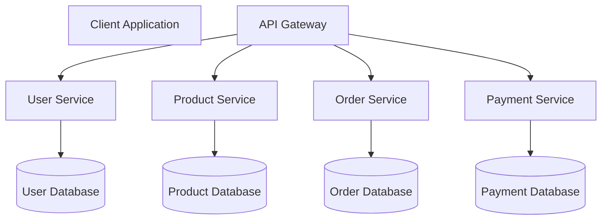

# Enterprise Microservices Documentation

## Table of Contents

1. [Architecture Overview](#architecture-overview)
2. [Service Descriptions](#service-descriptions)
3. [Deployment Process](#deployment-process)
4. [CI/CD Pipeline](#cicd-pipeline)
5. [Environment Variables](#environment-variables)
6. [Monitoring & Logging](#monitoring--logging)
7. [Troubleshooting Guide](#troubleshooting-guide)
8. [Folder Structure](#folder-structure)
9. [Conclusion](#conclusion)

---

## Architecture Overview

This application follows a **Microservices Architecture**, where each service is independently deployed and communicates with other services through REST APIs. This architecture improves scalability, maintainability, and fault isolation.

### System Architecture




---

## Service Descriptions

| Service | Responsibility | Database |
|----------|----------------|----------|
| API Gateway | Routes client requests to appropriate services | None |
| User Service | Handles authentication and user management | MySQL |
| Product Service | Manages products and inventory | PostgreSQL |
| Order Service | Processes customer orders | MySQL |
| Payment Service | Processes customer payments | PostgreSQL |


---

## Deployment Process

The deployment process consists of the following steps:

1. Developer pushes code to GitHub.
2. GitHub Actions automatically starts the CI/CD pipeline.
3. Unit tests and quality checks are executed.
4. Docker image is built.
5. Docker image is pushed to Docker Hub.
6. Kubernetes deploys the latest application version.
7. Health checks verify successful deployment.

### Deployment Commands

```bash
git clone https://github.com/company/ecommerce-app.git

cd ecommerce-app

docker build -t ecommerce-app .

docker push ecommerce-app:latest

kubectl apply -f kubernetes/
```


---

## CI/CD Pipeline


### Pipeline Stages

| Stage | Description |
|--------|-------------|
| Build | Compiles the application |
| Test | Executes unit and integration tests |
| Package | Creates Docker image |
| Deploy | Deploys the application to Kubernetes |
| Verify | Performs health checks |


---

## Environment Variables

| Variable | Description | Example |
|-----------|-------------|---------|
| DB_HOST | Database hostname | localhost |
| DB_PORT | Database port | 3306 |
| DB_USER | Database username | admin |
| DB_PASSWORD | Database password | password123 |
| API_PORT | Application port | 8080 |
| JWT_SECRET | Secret key used for authentication | mySecretKey |

### Example `.env`

```env
DB_HOST=localhost
DB_PORT=3306
DB_USER=admin
DB_PASSWORD=password123

API_PORT=8080

JWT_SECRET=mySecretKey
```


---

## Monitoring & Logging

The application uses centralized monitoring and logging to ensure system reliability and quick issue detection.

### Monitoring Tools

- Prometheus
- Grafana

### Logging Tools

- ELK Stack
- Kibana

### Sample Log

```text
2026-06-26 15:10:22 INFO OrderService

Order ID: 10245

Order Status: SUCCESS

Response Time: 145 ms
```


---

## Troubleshooting Guide

| Problem | Possible Cause | Solution |
|----------|----------------|----------|
| Service unavailable | Service stopped | Restart the service |
| Database connection failed | Database server offline | Verify database connectivity |
| HTTP 500 Error | Internal server exception | Review application logs |
| High CPU usage | Heavy application traffic | Scale application pods |
| Authentication failed | Invalid JWT token | Generate a new authentication token |

### Useful Commands

Check running Kubernetes pods

```bash
kubectl get pods
```

View application logs

```bash
kubectl logs deployment/order-service
```

Restart a deployment

```bash
kubectl rollout restart deployment order-service
```

Check Docker containers

```bash
docker ps
```

Check MySQL service status

```bash
systemctl status mysql
```


---

## Folder Structure

```text
enterprise-microservices/
│
├── api-gateway/
├── user-service/
├── product-service/
├── order-service/
├── payment-service/
│
├── docker/
├── kubernetes/
├── config/
├── logs/
├── scripts/
│
├── README.md
├── docker-compose.yml
└── .env
```


---

## Conclusion

This document provides a comprehensive overview of the enterprise microservices application, including its architecture, deployment workflow, CI/CD pipeline, environment configuration, monitoring strategy, and troubleshooting procedures.

Following these practices helps ensure reliable deployments, improved scalability, easier maintenance, and enhanced system availability across production environments.

[Back to Table of Contents](#table-of-contents)
